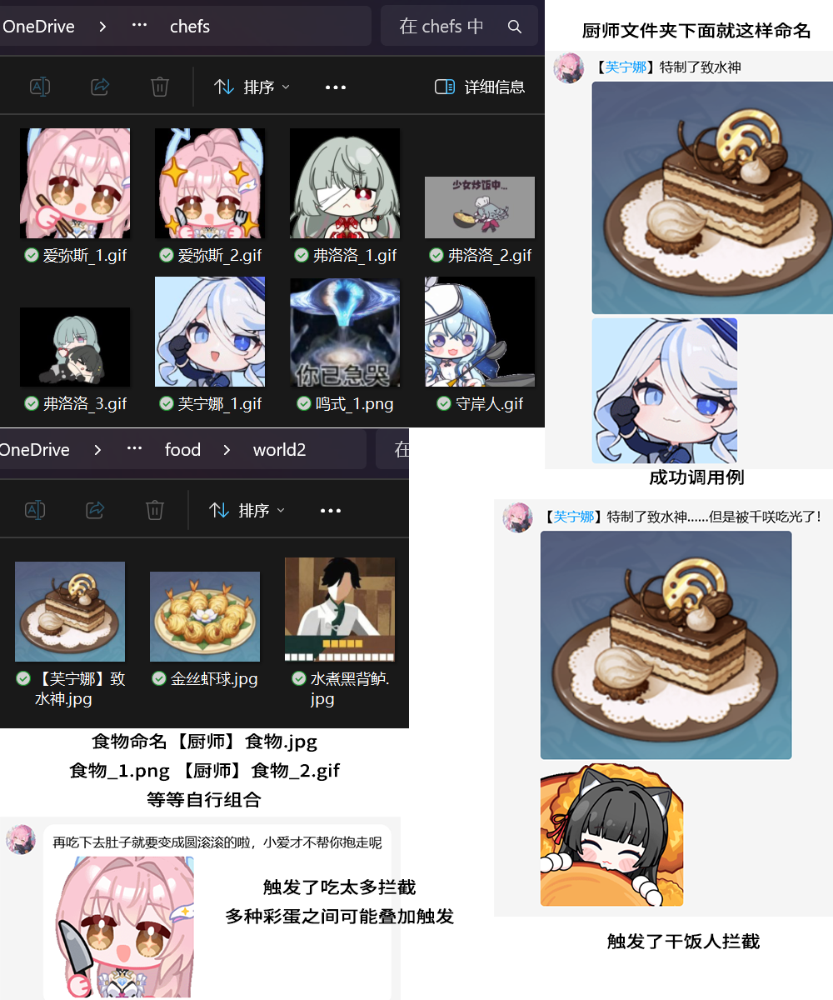
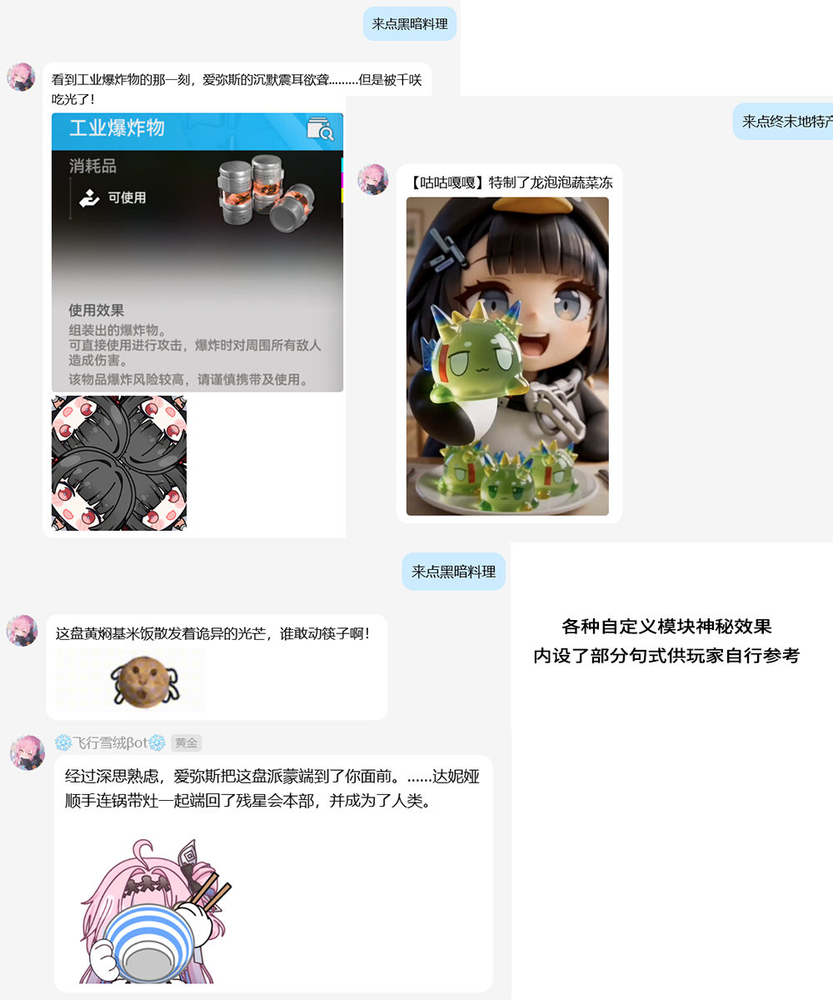

#🚀 🍱 千小妹还在吃 (Chisa Still Eating) v2.3.1Beta 更新日志
本次更新标志着本插件正式迈入 “MOD 自由创作时代”！我们重构了核心数据交互逻辑，赋予了各位向导更大的自定义空间。

✨ 核心更新：MOD 干饭人系统
全面开放自定义接口：新增 MOD 表情包加载引擎。现在，你可以在 data/plugin_data/astrbot_plugin_chisa_still_eating/ganfanren/ 目录下自由创建文件夹，放入自定义表情包与 words.txt 语录，即可让它们无缝加入干饭抽签池。

自定义语录支持：每个干饭人现在都拥有专属的“出厂语录”，抢饭不再是简单的表情输出，而是拥有灵魂的互动。

智能扫描机制：系统将自动扫描出厂自带与用户自定义的资源目录，无需额外配置，开箱即用。

💡 实战案例：如何创建你的专属“MOD 干饭人”？
想要让你的本命角色加入抢饭大军吗？以添加《公主连结》中的佩可莉姆为例，只需三步：

新建目录：前往机器人数据目录 data/plugin_data/astrbot_plugin_chisa_still_eating/ganfanren/，在其中新建一个文件夹，命名为 佩可莉姆。

放入表情包：将准备好的佩可莉姆干饭表情图片（支持 .png, .jpg, .gif 等格式）直接拖入 佩可莉姆 文件夹中。图片越多，随机抽取的表情越丰富！

编写专属语录：在 佩可莉姆 文件夹内新建一个文本文件，命名为 words.txt。打开它，按照“一行一句话”的格式写入你的抢饭彩蛋即可

# 🍱 千小妹还在吃 (Chisa Still Eating)

一个为 [AstrBot](https://github.com/Soulter/AstrBot) 打造的沉浸式跨次元干饭插件。
每天都在纠结吃什么？那就让二次元的向导们来帮你随机摇号吧！
项目代码由美国豆包编写，预留了自行拓展的接口，不过感觉4个世界观基本够用了，感兴趣的可以自己改改。
好用的话麻烦帮我点个免费的star☆吧

当前版本：`v2.3.1Beta` | 作者：Rua432

***

**💡 核心资源包下载提示（必看）**

源码中仅包含核心的结构文件与基础干饭人表情包，不含大体积的美食图片库和对应表情包。为了保证插件完美的图文出图体验，**强烈建议下载预设资源包（Plugin_data）并解压覆盖到机器人的 `data/plugin_data/` 目录下！**

* 📥 **官方资源包下载**：[点击此处前往 Releases 下载](https://github.com/dddada123/astrbot_plugin_chisa_still_eating/releases/download/Plugindata/plugin_data.zip)

* 🔗 **备用网盘链接**：
链接：https://pan.quark.cn/s/9800f1abdda0
https://pan.baidu.com/s/1gvuKjAlSGGEKpBZ_LIsQTw 提取码: 6sc6

*(🌱 温馨提示：目前的图库完全由作者纯手工收集，完整度难免有缺漏。极其欢迎大家在讨论区或群内分享、贡献自己维护好的精美图库，让我们共同补全全宇宙的美食！)*

***

## 📖 1. 项目简介

本插件不仅仅是一个简单的随机抽图机，为了实现极致的**“角色扮演沉浸感”**，我们在底层铺设了极其严密的逻辑：

* 🌍 **跨次元大乱斗与现实隔离**：支持《鸣潮》、《原神》等多个世界观配置。抽到异界特产会触发联动对话串门；如果抽到三次元的“黄焖鸡米饭”，系统会智能切换接地气的现实句式，绝不违和。

* 📸 **物理免配看图下菜**：无需繁琐修改代码或 JSON！把美食图片放进对应的文件夹，系统立刻自动读取加载。文件名甚至支持直接识别厨师，并触发展示厨师专属立绘。

* 🛑 **防重复与刷屏制裁**：群组独立记忆，防重复吃同一道菜。如果群友疯狂点菜刷屏，不仅会触发导游的“无语”表情打断，还会引来其他“干饭人”强行截胡，直接抢走你的饭！

* 👻 **AI 大模型情绪接驳**：支持现场调用 AstrBot 底层大模型，让你的BOT根据抽出的菜品即兴发挥陪聊，拉满情绪价值。

***

## 📸 2. 实际效果演示

各模块之间完美协同，根据群友的指令和频率，提供完全不同的情绪反馈与跨次元互动：

  
  

***

## ⚙️ 3. 功能详解与使用指南

### 📂 物理资源库目录说明

安装好插件并解压资源包后，请留意以下极其重要的物理目录映射结构（你可以随时向文件夹内添加新图片来“加菜”）：

**🍔 1. 美食与饮品图库** (`data/plugin_data/astrbot_plugin_chisa_still_eating/`)

* `food/common/`：**三次元（现实）特产库**。存放汉堡、奶茶等现实食物。只会被“现实触发词”或保底机制抽出。

* `food/world1/` ~ `world4/`：**二次元世界专属特产库**。如 `world1` 对应鸣潮，存放“龙吐珠”；`world2` 对应原神等。

* **🍳 厨师前缀系统**：在图片文件名前加上括号（如 `【香菱】水煮黑背鲈.png`），系统会自动解析厨师为“香菱”并触发联动！

**🎭 2. 导游情绪映射库** (`data/plugin_data/astrbot_plugin_chisa_still_eating/memes/`)
推荐官的反应会根据抽卡结果**动态变化**（按世界观 `world1` 等分类存放）：

* `like/` (欢快/推荐)：抽中普通美食时发送。

* `scared/` (惊恐/抗拒)：触发“黑暗料理”指令时发送，如戴着防毒面具的图。

* `think/` (沉思/摆烂)：重复触发冷却机制时，向导陷入发呆的图。

* `speechless/` (无语/打断)：疯狂点菜触发防刷屏警报时，制止你的表情包。

**👨‍🍳 3. 厨师立绘图鉴** (`data/plugin_data/astrbot_plugin_chisa_still_eating/chefs/`)

* 存放各类大厨的单独图片（如 `香菱.jpg`）。抽中该大厨的菜时概率触发展示。

**⚔️ 4. 干饭人拦截彩蛋** (`插件源码目录/Still_eating_meme/`)

* **注意：此目录内置在源码文件夹中！**

* 包含 `千咲/`、`派蒙/`、`达妮娅/`、`小小爱/` 等角色文件夹。当触发刷屏被拦截时，系统会**根据你在 WebUI 后台指定选择的干饭人**，从对应的文件夹里抽出“抢饭图”，直接把你的菜端走！

### 💬 群聊使用指令

部署完成并重启机器人后，群友发送以下消息即可触发干饭系统：

* **基础摇号**：`吃什么` / `吃啥` / `喝什么` / `喝啥`

* **三次元隔离**：`来点现实的食物` / `来点现实的饮品` (锁定抽取家常菜与外卖)

* **异界特产**：`[世界别称]特产` (如 `鸣潮特产` / `原神特产`)

* **作死模式**：`来点黑暗料理` (建议自备复活药)

* **快捷帮助菜单**：`千小妹吃什么帮助` (在群内随时呼出内置指南)

***

## 🤝 4. 跨平台迁移与开源协议

本项目代码采用 [MIT License](LICENSE) 协议完全开源发布。

**非常欢迎其他聊天机器人平台（如 NoneBot、Koishi 等）的开发者自行移植、迁移或二创使用本插件！** 为尊重开源心血，如果您进行了移植或公开发布，**请务必在衍生项目的主页显著位置（或机器人的帮助菜单中）包含并保留以下版权信息与原始链接**：

1. 原项目 GitHub 仓库：[Rua432/astrbot_plugin_chisa_still_eating](https://github.com/Rua432/astrbot_plugin_chisa_still_eating)

2. 原作者 Bilibili 主页：[Rua432 的哔哩哔哩空间](https://space.bilibili.com/501751)

***

## 📜 5. 素材鸣谢与出处声明

本插件能够拥有如此生动的沉浸感，离不开以下优秀创作者的二创表情包与官方素材。在此向各位用爱发电的作者致以最诚挚的感谢（排名不分先后）：

* **爱弥斯表情包**：感谢 B站 Up主 [凉梦喵啦啦啦](https://www.bilibili.com/video/BV1jN5z6VEYU/) 及 Up主 [Stephen樽](https://www.bilibili.com/video/BV1GHfUBzEZd/) 的制作分享。

* **千咲表情包**：感谢 B站 Up主 [好好咲w](https://www.bilibili.com/video/BV1Fz5q6GEVA/) 的制作分享。

* **达妮娅表情包**：感谢 B站 Up主 [好好咲ww](https://www.bilibili.com/video/BV1drAHzyEGY/) 的制作分享。

* **小小爱表情包**：感谢 B站 Up主 [铃兰花酱](https://www.bilibili.com/video/BV1PGDqBqEMD/) 的制作分享。

* **派蒙表情包**：素材源自 **《原神》官方&HOYOLAB制作分享**。（我说原神牛逼有没有懂的）

*(注：以上部分表情包素材仅供开源娱乐与学习交流使用，美术版权归原画师或官方所有。)*

***

## ☕ 6. 赞助与支持 (完全自愿)

本插件及其核心逻辑**本体完全免费、永久开源**。
如果你觉得这个跨次元点餐系统给你的群聊或社区带来了快乐，欢迎随缘打赏，就当请作者喝杯奶茶或者买个甜甜圈啦~ ❤️

  
  微信
  
  ZFB

